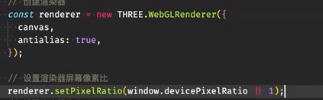
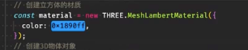
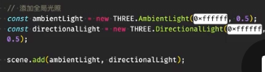
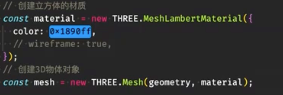
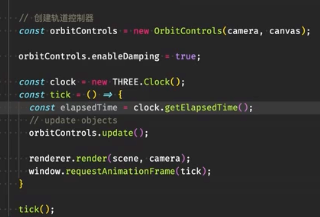
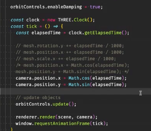
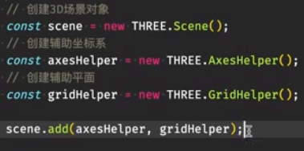
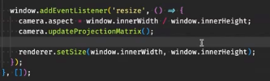

# 抗锯齿
默认关闭，考虑性能;



# 没有明显的3d效果
MeshLambert (材质对光照敏感)，需要有光照



# 光照
使用光感材质的 需要创建平行光


	
> 正方体6个面能不能不同颜色? (换成数组)




# 动画
将元素动起来，添加轨道控制器。

添加 orbitControls


# 移动
    相机移动、物体移动

# 创建辅助平面
gridHelper


# 屏幕自适应
```
更新相机投影矩阵，更新场景比例
```


# 创建
